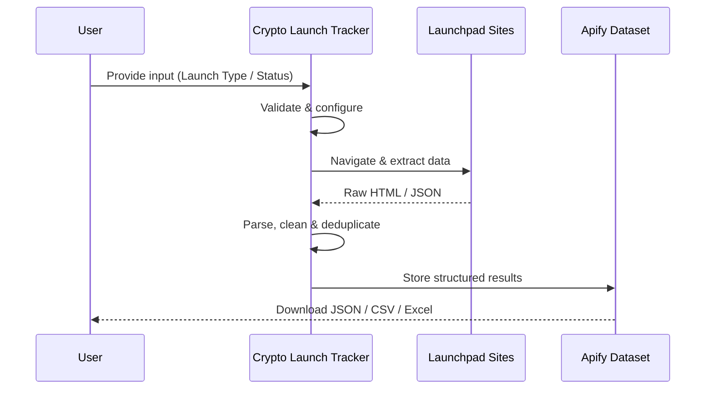
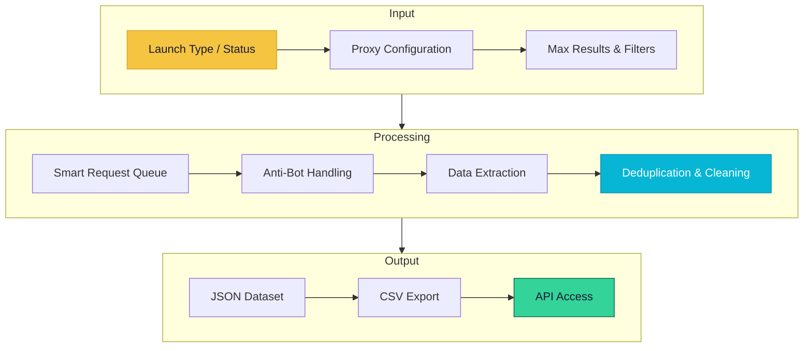

# Crypto Launch Tracker

> Monitor upcoming ICOs, IDOs, and token launches across launchpads with funding data and schedules

[](https://apify.com/george.the.developer/crypto-launch-tracker?fpr=bbquoh)
[](https://github.com/the-ai-entrepreneur-ai-hub/crypto-launch-tracker)
[](LICENSE)

---

## Overview

Crypto Launch Tracker aggregates data from major crypto launchpads and listing sites to track upcoming token launches. Get pre-launch intelligence including project details, team backgrounds, funding rounds, tokenomics, and scheduled launch dates for informed investment decisions.

   

---

## Architecture


---

## How It Works



**Step-by-step:**

1. **Input Validation** — Your configuration is validated and the scraping session is initialized with optimal proxy settings
2. **Smart Crawling** — Crawlee manages request queues, retries, and proxy rotation automatically for maximum reliability
3. **Data Extraction** — Structured data is parsed from each page using optimized selectors and anti-detection measures
4. **Deduplication** — Results are deduplicated and cleaned to ensure high data quality with no duplicates
5. **Output Delivery** — Clean, structured data is saved to your Apify dataset for download or API access

---

## Input Parameters

| Parameter | Type | Description |
|-----------|------|-------------|
| `launchType` | `String` | Type: ico, ido, ieo, fairlaunch, presale |
| `status` | `String` | Status: upcoming, active, ended |
| `blockchain` | `String` | Target blockchain filter |
| `maxResults` | `Number` | Maximum launches to track |
| `minRaise` | `Number` | Minimum fundraise amount in USD |

### Input Example

```json
{
  "launchType": "ido",
  "status": "upcoming",
  "blockchain": "solana",
  "maxResults": 25,
  "minRaise": 500000
}
```

---

## Output Fields

| Field | Type | Description |
|-------|------|-------------|
| `projectName` | `String` | Project/token name |
| `symbol` | `String` | Token ticker symbol |
| `launchType` | `String` | Type of launch (ICO/IDO/IEO) |
| `launchDate` | `String` | Scheduled launch date |
| `platform` | `String` | Launchpad platform |
| `raiseTarget` | `Number` | Target fundraise amount |
| `tokenPrice` | `Number` | Initial token price |
| `blockchain` | `String` | Target blockchain |
| `website` | `String` | Project website URL |
| `socialLinks` | `Object` | Twitter, Telegram, Discord links |

### Output Example

```json
{
  "projectName": "SolFi Protocol",
  "symbol": "SOLFI",
  "launchType": "IDO",
  "launchDate": "2026-03-25",
  "platform": "Raydium AcceleRaytor",
  "raiseTarget": 2000000,
  "tokenPrice": 0.05,
  "blockchain": "Solana",
  "website": "https://solfi.io",
  "socialLinks": {
    "twitter": "@solfi_protocol",
    "telegram": "t.me/solfi"
  }
}
```

---

## Use Cases

- **Investment Research** — Discover and evaluate upcoming token launches before they go live
- **Portfolio Strategy** — Plan investment allocation based on upcoming launch schedules
- **Market Intelligence** — Track fundraising trends and popular launch platforms across crypto
- **Due Diligence** — Collect team and project data for pre-investment research

---

## Data Flow



---

## Pricing

This actor uses Apify's **Pay-Per-Event** pricing. You only pay for what you use.

| Event | Price | Description |
|-------|-------|-------------|
| `launch-tracked` | $0.005 | Per token launch extracted and tracked |
| `project-profiled` | $0.01 | Per project deep profile |

> Free tier available on Apify. No credit card required to start.

---

## Getting Started

### Run on Apify Console

1. Go to [Crypto Launch Tracker on Apify Store](https://apify.com/george.the.developer/crypto-launch-tracker?fpr=bbquoh)
2. Click **"Try for free"**
3. Configure your input parameters
4. Click **"Start"** and wait for results
5. Download your data as JSON, CSV, or Excel

### Run via API

```bash
curl -X POST "https://api.apify.com/v2/acts/george.the.developer~crypto-launch-tracker/runs" \
  -H "Content-Type: application/json" \
  -H "Authorization: Bearer YOUR_API_TOKEN" \
  -d '{"launchType":"ido","status":"upcoming","blockchain":"solana","maxResults":25,"minRaise":500000}'
```

### Run with Python

```python
from apify_client import ApifyClient

client = ApifyClient("YOUR_API_TOKEN")
run = client.actor("george.the.developer/crypto-launch-tracker").call(
    run_input={
    "launchType": "ido",
    "status": "upcoming",
    "blockchain": "solana",
    "maxResults": 25,
    "minRaise": 500000
}
)

for item in client.dataset(run["defaultDatasetId"]).iterate_items():
    print(item)
```

---

## Tech Stack

| Technology | Purpose |
|------------|---------|
| **Node.js** | Runtime environment |
| **Crawlee** | Web scraping and crawling framework |
| **Cheerio** | Fast HTML parsing and data extraction |
| **Apify SDK** | Actor lifecycle, storage, and proxy management |

---

## Related Actors

More data extraction tools by [George The Developer](https://apify.com/george.the.developer?fpr=bbquoh):

- [Reddit Scraper Pro](https://apify.com/george.the.developer/reddit-scraper-pro?fpr=bbquoh) — Extract posts, comments, user profiles, and subreddit data from Reddit at scale 
- [AI Training Data Scraper](https://apify.com/george.the.developer/ai-training-data-scraper?fpr=bbquoh) — Collect structured, clean datasets from the web purpose-built for training machi
- [Influencer Marketing Intel](https://apify.com/george.the.developer/influencer-marketing-intel?fpr=bbquoh) — Discover and analyze social media influencers with engagement metrics, audience 
- [Google Maps Leads & Website Audit](https://apify.com/george.the.developer/google-maps-leads-website-audit?fpr=bbquoh) — Extract business leads from Google Maps with automated website audits for contac
- [App Review Pain Miner](https://apify.com/george.the.developer/app-review-pain-miner?fpr=bbquoh) — Extract and analyze app store reviews to discover user pain points, feature requ

[View all actors on Apify Store >>>](https://apify.com/george.the.developer?fpr=bbquoh)

---

## Support

- **Apify Store**: [https://apify.com/george.the.developer/crypto-launch-tracker?fpr=bbquoh](https://apify.com/george.the.developer/crypto-launch-tracker?fpr=bbquoh)
- **GitHub Issues**: [Report a bug](https://github.com/the-ai-entrepreneur-ai-hub/crypto-launch-tracker/issues)
- **Author**: [George The Developer](https://apify.com/george.the.developer?fpr=bbquoh)

---

## License

MIT License. See [LICENSE](LICENSE) for details.

---

*Built with Crawlee and the Apify SDK by [George The Developer](https://apify.com/george.the.developer?fpr=bbquoh). Star this repo if you find it useful!*
